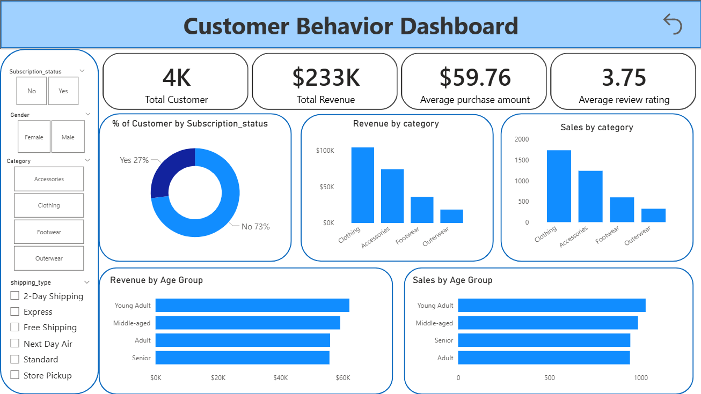

# 📊 Customer Behavior Analysis

## 📌 Project Overview
This project analyzes customer purchase behavior to extract meaningful business insights. It demonstrates an end-to-end data analytics workflow using Python, SQL, and Power BI.

---

## ❓ Problem Statement
Businesses need to understand:
- Who are their most valuable customers
- Which products perform best
- How purchasing behavior changes over time

This project solves these problems using data analysis and visualization.

---

## 🛠️ Tools & Technologies
- Python (Pandas, NumPy, Matplotlib, Seaborn)
- SQL (MySQL / PostgreSQL)
- Power BI

---

## 🔄 Project Workflow

### 1. Data Analysis (Python)
- Performed Exploratory Data Analysis (EDA)
- Cleaned and preprocessed the dataset
- Identified patterns and trends

### 2. Feature Engineering
- Created Purchase Frequency (e.g., weekly buyers)
- Segmented customers into Age Groups

### 3. SQL Analysis
Solved business questions such as:
- Top 3 category by revenue
- Best-performing products
- Weekly product trends
- Additional analytical queries

### 4. Data Visualization (Power BI)
- Built an interactive dashboard
- Visualized customer segments
- Analyzed product performance and KPIs

📷 Dashboard Preview

🚀 How to Run the Project

1. Clone the repository

git clone <(https://github.com/Sonallgavali/Customer_behaviour_analysis)>

2. Install dependencies

pip install -r requirements.txt

3. Run the Jupyter Notebook for analysis

4. Execute SQL queries in your database

5. Open the Power BI file to view the dashboard

---

📌 Key Insights

High-value customers contribute the majority of revenue

Certain products consistently perform better

Customer segmentation improves understanding of behavior

---

📚 Learning Outcome

Understood end-to-end data analytics workflow

Learned how Python, SQL, and Power BI integrate

Improved data analysis and visualization skills

🔗 References

Walkthrough Video: (https://youtu.be/5PrZvPeUw60?si=F88rXWN38H3Tp1be)
